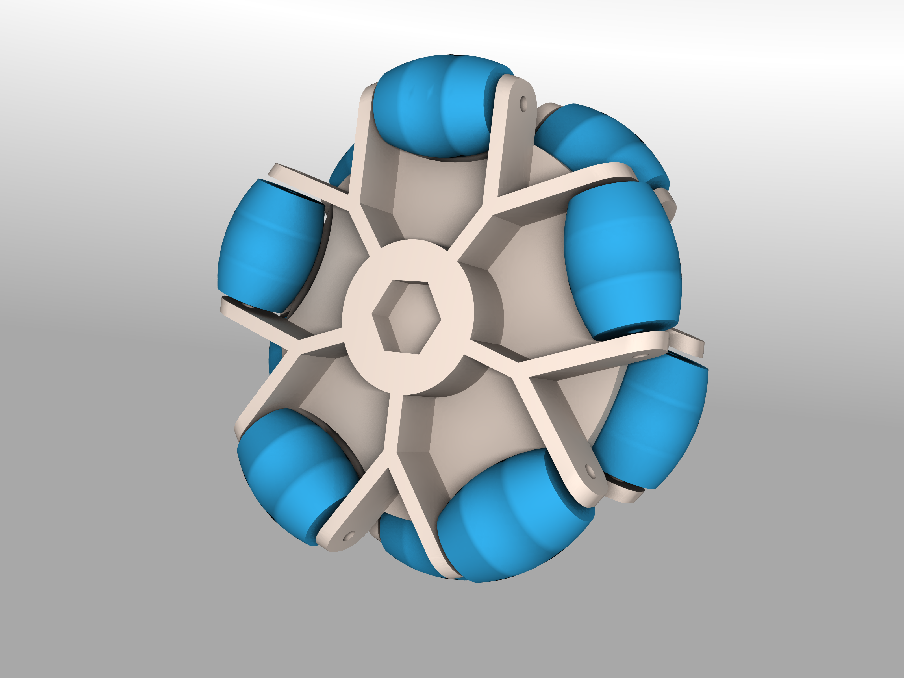

# FreeCAD-Omniwheel
Modelo en FreeCAD capaz de generar ruedas tipo omniwheel.
--------

Descripcion
--------
Modelo paramétrico diseñado en FreeCAD para facilitar el diseño de ruedas tipo omniwheel. Utiliza el banco de trabajo Spreadsheet para la referencia de variables y calculo de parámetros utilizados en el modelo. 

Algunos parámetros que se pueden editar: 
* Cantidad de 'ruedas' 
* Diámetros de la rueda 
* Tolerancia(espacio extra entre la ruedas y el soporte) 
* Grosor del soporte

**Requiere Freecad 0.16 o superior**
Autor
-----
Gustavo Segura(gsegura96). Jul-2016

Licencia
-----

